# Build an enhanced IT helpdesk chatbot on IBM i with Watson Assistant

## Deploy a chatbot prototype that can understand and automatically solve password-related issues on IBM i

+ Ross Cruickshank June 06, 2019
+ Christophe Lalevée January 18, 2018
+ (First published December 20, 2017)


Chatbots are conversational robots that simulate conversation, and can interact with users in natural language. By harnessing both the power of the IBM Cloud Watson services, and the power and openness of IBM i, you can open up your chatbot to countless creative applications (such as a virtual agent) that can understand and automatically solve password-related issues.
This workshop guides you through implementing a prototype of such a chatbot running on IBM i that links the IBM Watson Assistant service and IBM i system services.

**_Watson Conversation is now Watson Assistant. Although some illustrations in this tutorial may show the service as Watson Conversation, the equivalent steps and processes will still work._**

## Introduction

Did you know that as per recent studies, an average of 20% to 50% of all help desk calls are password related?
Mundane tasks can be a headache for help desk teams, especially when higher priority jobs need attention. Virtual assistants (also known as _chatbots_ ) for IT help desk
can automatically process tickets that do not need deep expertise such as managing access credentials and password-related issues, allowing your staff to focus on critical issues and value-added tasks. For instance, a chatbot can analyse the root cause and automatically solve password-related issues.

In this project, you will implement a simple chatbot to illustrate this kind of solution.

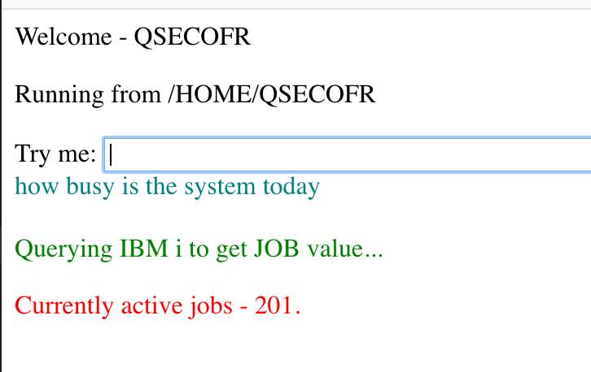

It can understand user profile-related issues, and, if possible, automatically solve the problem. As the icing on the cake, it can also answer to queries about system utilisation, such as processor utilisation or the percentage of system auxiliary storage pool (ASP) used.

It will be implemented in the prototyping mode with Node-RED, and will run natively on IBM i.

You are now going to instantiate and configure the required services, import the Watson Assistant workspace (predefined dialog training) and Node-RED flow (chatbot broker program), and test it!

## What you'll need

To implement this chatbot on your IBM i system, you need:

- An IBM i 7.3 partition with Node-RED installed
- An IBM Cloud (earlier known as IBM Bluemix®) account to be able to provision Watson Assistant services.

Register for your free trial account (or log in to IBM Cloud if you already have an account) at [cloud.ibm.com](https://ibm.biz/Bd2UVu)


**Note:**
If you want to create a [Twilio](https://www.twilio.com) account, you will be able to send SMS authorisation codes from the chatbot program. In the following example, the
authorisation code is sent to the browser as an information message (not best secure ...)

## Architecture overview

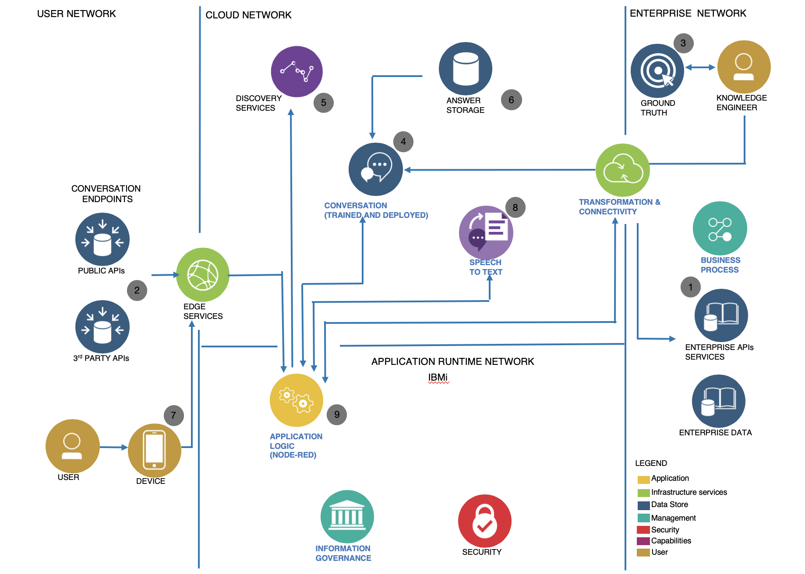

To implement this IT help desk chatbot on IBM i, core components must be deployed and configured.

### Chatbot architecture

The main components are:

1. IBM Watson Assistant service providing natural language capabilities: intents/entities
recognition and dialog management.
1. Your chatbot broker program, implemented with Node-RED on your IBM i system. It is the core of the solution, called application logic, linking all the components:
  + Watson Assistant service
  + user interface
  + IBM i system and database
1. IBM i system and the IBM Db2® database for retrieving and updating IBM i user profile (*USRPRF*) attributes.

In this prototype, the Node-RED program can directly query the database or run the program. But, in a multi-system configuration, this component must be independent and deployed on all systems. Then data and services are available through web services [Representational State Transfer (REST) APIs](https://en.wikipedia.org/wiki/Representational_state_transfer).

Let's us see how to set up these components.

## IBM Cloud: Deploy and train Watson Assistant service

In this first part, you will instantiate, train, and test Watson Assistant, (the Watson cognitive service
in charge of dialog with a chatbot user).

The IBM Watson Assistant service combines machine learning, natural language understanding, and integrated dialog tools to create conversation flows between your applications and your users.

Perform the following steps to create your own Watson Assistant instance:


1. Log in to IBM Cloud using your IBM Cloud account.
<!-- 1. Select the region and space you want to work in. -->
1. Click `Catalog` on the top menu bar , then click `AI` in the left navigation panel. The catalog displays the available Watson services. Click `Watson Assistant` to view the service configuration page.
1. Provide a unique service name (or use the default service name), and choose plan Lite (free).
This plan allows 10,000 API calls per month, five workspaces, 25 intents and 25 entities. If
you need more, you can subscribe to Standard or Premium plans. Click `Create`.
1. In the new service dashboard that is displayed, click `Launch Watson Assistant` for the web tooling
interface where you can define intents, entities, and the dialog for conversation.
1. Click the `Create a Skill` button. You'll see a screen showing any existing skills, and another `Create skill` b utton - click that.
1. Click on the area for the `Dialog skill` box, then click `Next`

### <div id=waimport>Watson Assistant: Import a conversation</div>

In this part, you will import a conversation flow to handle a dialog with a help desk chatbot user.
The JSON file containing the dialog flow [**iHelpdesk.json**](/iHelpdesk.json) is provided as a starter to get you going; download this to your workstation.

The Watson Assistant tool page allows to create a new workspace or to import an exported one. A _workspace_ is a container for the artifacts that define the conversation flow for an application.

Perform the following steps to import a conversation flow:
1. Get ready to import the **iHelpdesk.json** workspace by clicking the `Import skill` option
1. Click `Choose JSON file` , and select the [**iHelpdesk.json**](/iHelpdesk.json) file, previously downloaded.
1. Click `Import`
1. A new Skill workspace is created and opened - if you want to rename the skill, click `Skills` to return to the main Skills view, click on the  and follow the options to rename.
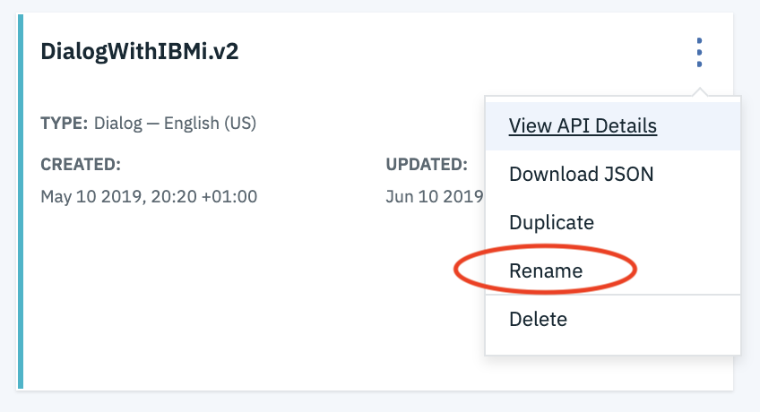
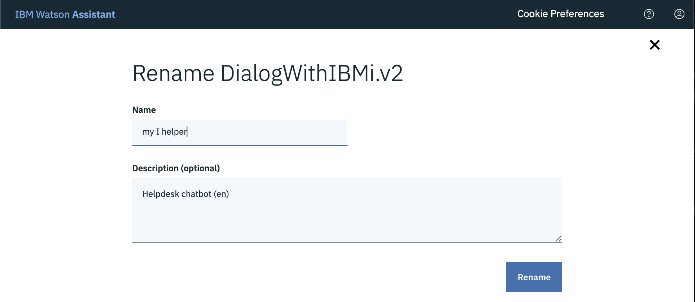

Note:
A Conversation consists of the following three types of data:

- **Intents** (the verb)

    Intents represent the purpose of a user's input. You can think of intents as the actions your users might want to perform in your application.Example: A user wants to know the value of a system resource
- **Entities** (the name)

    An entity represents a term or an object in the user's text that provides clarification or a specific context for a particular intent. By recognizing the entities that are mentioned in the user's entry, the Watson Assistant service can choose the specific actions to perform to achieve a given intent. Example entity: System resource (such as processor, disk, memory, and so on)
- **Dialogs** (the flow)

    The dialog defines the flow of your conversation as a logical tree. Each node of the tree has a condition that triggers it, depending on the input of the user.The purpose of the dialog is to lead to the answer to a question or the execution of an action or a command.

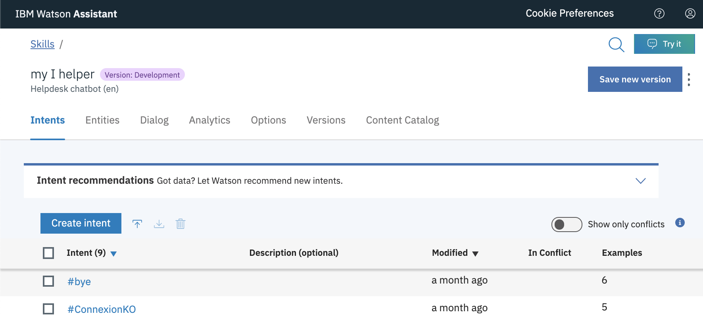

### <div id=waov>Watson Assistant: Understanding a conversation </div>

You can have a look at the workspace content to get an idea of the questions you could ask to the chatbot (in the **Intents** and **Entities** tabs) or understand the way the dialog flow has been created
(in the **Dialog** tab).

For example, you can try to understand the _Password Lost_ flow implementation in the Watson Assistant service. This illustrates how the **#MotDePasseKO** intent dialog has been designed

### Reset password dialog

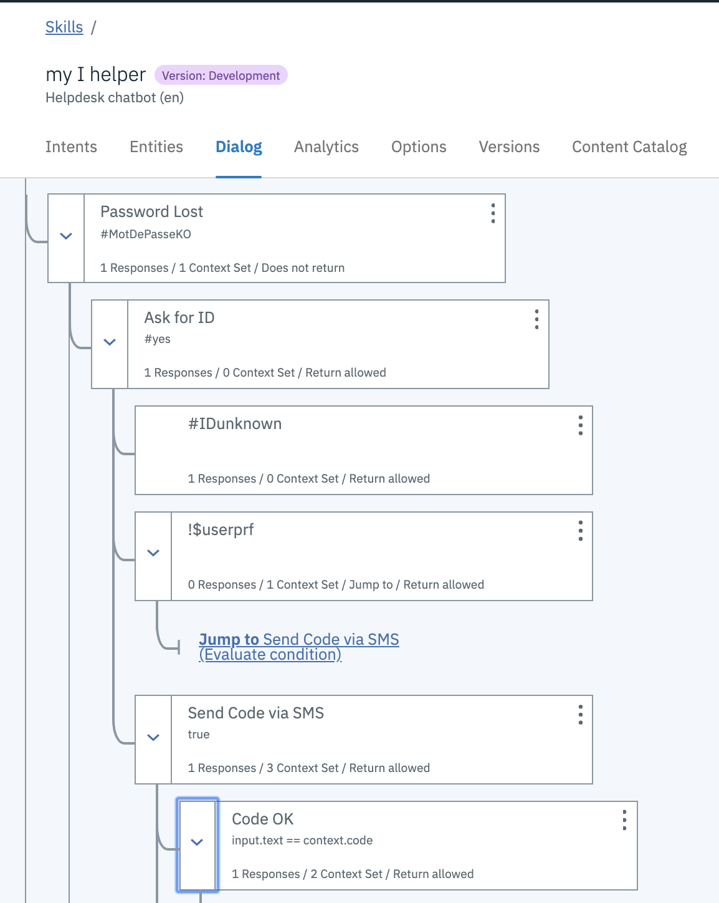

The chatbot program on IBM i will require the workspace ID and credentials to connect to the Watson Assistant API. To retrieve these values, click on on the skill's  and then click **View API Details**
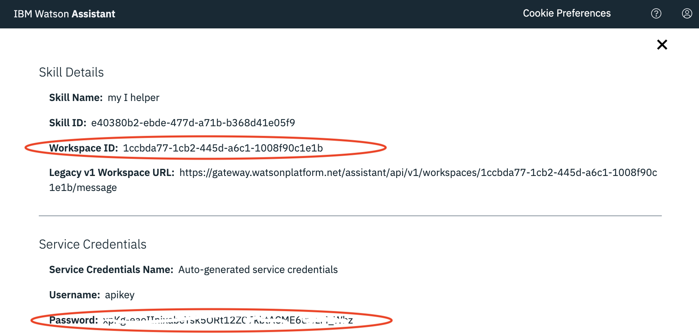

**Copy the WorkspaceID, and Password.**

Your Watson Assistant workspace is now configured. Intents, entities, and dialogs are ready to be used by your IBM i chatbot program.

If you want to learn more about Watson Assistant tool and interface, refer to the Watson Assistant documentation website.


## Twilio

Twilio is a cloud communications platform as a service (PaaS) that allows developers to
programmatically integrate voice, messaging, and VoIP into web and mobile apps.

You can access Twilio's services using web service APIs and you will be billed based on the usage.


In this article, we will use Twilio to implement a Two Factor Authentication (2FA) process. In this
process, the user is authenticated first by his Slack ID and then by his phone number (a validation
code is sent to the user's mobile number).

If you don't have an account yet, Twilio offers a trial version to all customers who sign up, which
includes a free balance for you to experiment with. When your balance gets low, Twilio sends you an email with the information required to upgrade your project.

Create a trial account (or connect to Twilio using your existing account) and obtain a SMS-capable phone number.

Check the following references for detailed information about Twilio configuration:

1. Sign up for a Twilio account
1. Get an SMS capable phone number used to send text messages.

After completing the configuration, retrieve and copy the following information that will be required to configure a Node-RED Twilio node:

+ security ID (SID) and authentication token from the Dashboard page.

+ An SMS-capable phone number (see Figure 14). To access this, click All Products & Services on the home page, and then click # Phone Numbers.

Note: If you want to send text messages to another phone number, you must declare it on the Verified Caller IDs page.

Your Twilio service is configured and ready to be used for authentication (2FA).


## Node-RED

Node-RED is a flow-based programming tool, originally developed by the IBM Emerging Technology Services team (in early 2013) and now a part of the JS Foundation.

Traditional development can be very technical, but Node-RED enables you to concentrate on the logic of your workflow, allowing fast prototyping.

If you want to know more about Node-RED and how to get started on IBM i, refer to the previous
IBM developerWorks® article, "Running Node-RED on IBM i: Installation and first flow".

### Install additional nodes in Node-RED

To implement this chatbot, you need to connect your chatbot program to IBM Watson Assistant (in the IBM Cloud platform), Twilio, and also locally to the IBM Db2 for i database.

By default, Node-RED doesn't install nodes for Watson software development kit (SDK), Twilio, or Db2 for i. So, you must now install them.

There are two ways to do that: Using the shell command line or the Node-RED UI.

First, let us install Db2 for i and Watson SDK nodes using the shell command line, then install
Twilio using the Node-RED UI.

**Install node-red-contrib-db2-for-i and node-red-node-watson packages**  
+ The `node-red-contrib-db2-for-i` package provides a node enabling read and write to a local Db2 for i database from Node-RED on IBM i.
+ The `node-red-node-watson` package provides a collection of nodes for IBM Watson services. Of course, it includes Watson Assistant node, which is the service supporting our chatbot dialog.

Using node package manager (NPM), you can install Node-RED packages globally (thus making it available for all Node-RED users) or locally (making it available for a specific user
environment only).
As these packages can be useful for every project, you should perform a global installation using
the npm shell command.
Start a shell session. It can be Qshell or remote Secure Shell (SSH). I recommend
using SSH. Read Jesse Gorzinski's article, "Eight Reasons to Embrace SSH" on IBMSystemsMag.com to be convinced.

To install the packages, run the following commands:
```
$ npm install -g node-red-contrib-db2-for-i

$ npm install -g node-red-node-watson

```
You can now see the packages installed in the npm global root directory:
```
$ ls /QOpenSys/pkgs/lib/nodejs8/lib/node_modules             
idb-connector                   node-red-contrib-cos       
itoolkit                        node-red-contrib-db2-for-i
node-pre-gyp                    node-red-node-watson       
node-red                        npm                        
$                                                          
```

Start Node-RED to load new nodes.
```
$ node-red
```

**Your Node-RED instance will start listening on a TCP port assigned to your USRPRF - the last 2 digits of your profile (XX) added to 19000.**

Open your browser enter the URL
http://<YOUR_SERVER_IP_ADDRESS>:190XX to open a page on Node-RED user interface.

In the palette, you can see the Db2 for i node and a new IBM
Watson category.

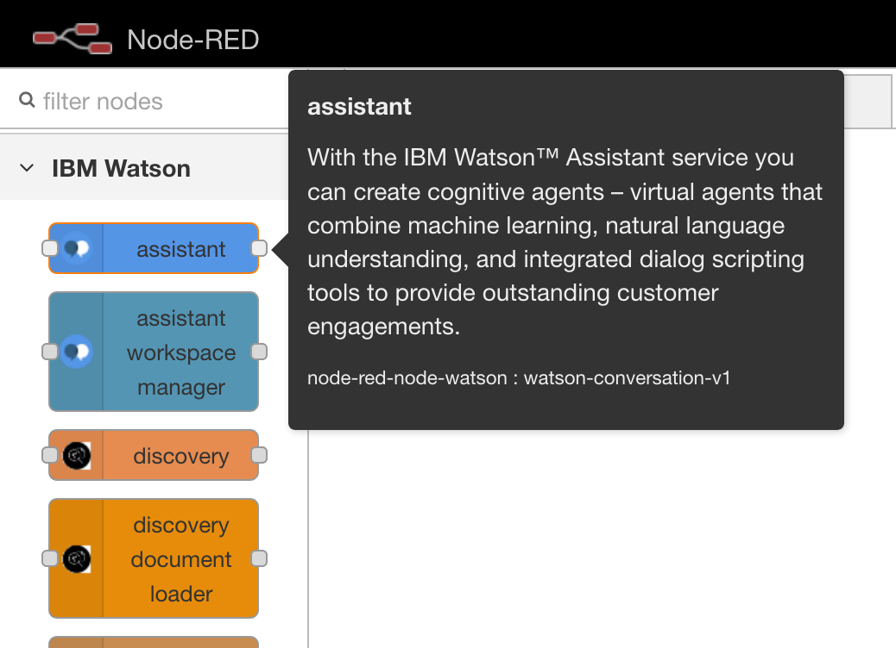


2. **Install Twilio package**

Next, let us install the Twilio node. The node-red-node-twilio package provides a Node-RED node to send SMS messages using the Twilio service. Install it through the palette manager:
1. Click the menu icon at the upper-right corner and click `Manage Palette`.
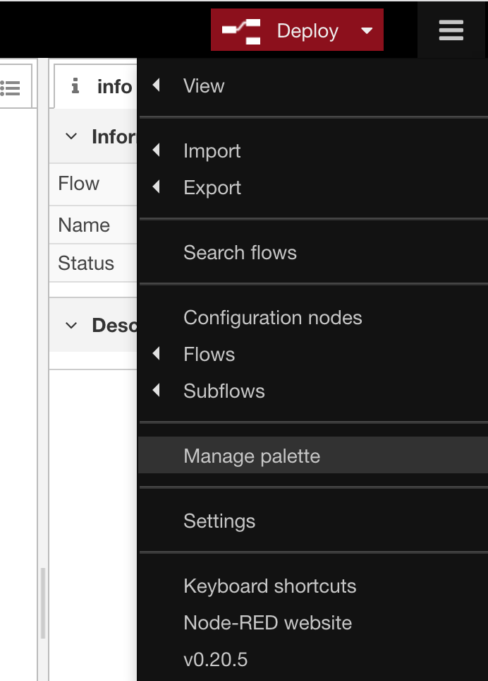
1. Click the `Install` tab and search for the word, "twilio".
In the list that appears, search for `node-red-node-twilio` and click `Install`.
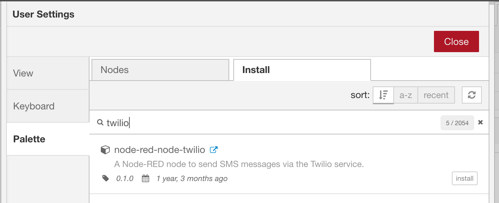
1. Wait for the installation confirmation message.
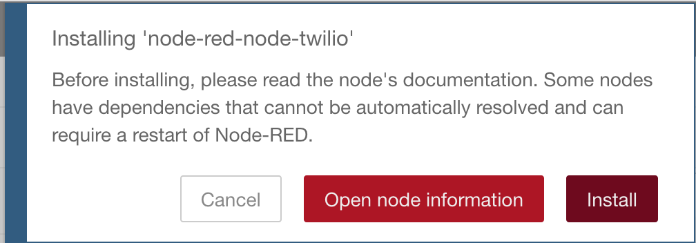


Let's now restart Node-RED. When restarted, take a look at the palette.  In the Mobile category, one Twilio node is now
available.
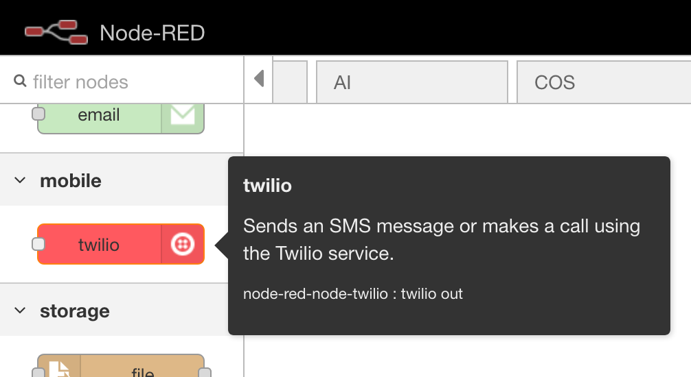

### Import flow and configure nodes

You are now going to import the chatbot flow and configure it to use your own services (Watson Assistant, and Twilio previously configured).

You need to get the Assistant artifacts (a JSON file), import it into Node-RED on IBM i, and deploy it.

**Get the code.**
To get the code, download the [Node-Red chatbot flow](ibmi-password-flow.json) file and copy the entire file's content into clipboard.

**Import the code.**
Go back to the IBM i Node-RED editor in your browser, click the menu at the upper-right corner
and click **Import -> Clipboard**. Then, paste the contents of the clipboard. Click **New flow** , and then click **Import**.


Click somewhere on the blank sheet to paste nodes.

Have a quick look at chatbot flow.

###  Chatbot flow overview
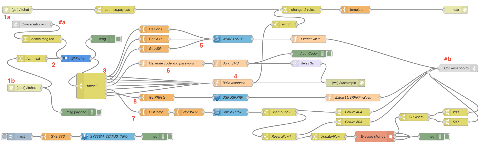

The numbering in the figure corresponds to the numbering in the following procedure that explains
the flow.

1. Get the text entered by the user.
2. Send it to the Watson Assistant service. This service understands the intent, identifies entities,
defines what to answer. It sends back an answer for the user and initializes variables in the context part of the
JSON object exchanged. The value of context.Action variable indicates whether an action
has to be executed by the chatbot (and what action) or not.
3. Depending on the Action variable value, the switch case node will route to perform one or two steps (from within step 4 to step 8).
4. Answer directly to the user.
5. Retrieve resource usage value from IBM i (by querying Db2 for i services).
6. Generate a temporary password and an authentication code, and send text. This will appear on the user's browser session. You can also use Twilio to send as SMS.
If you don't want to use SMS to send code, you can configure the email node to send it by email.
7. Change the user profile (\*USRPRF) IBM i object. First test if password reset is allowed (password not \*NONE), and then run the system `CHGUSRPRF` shell command.
8. Retrieve the user profile parameters from IBM i (by querying Db2 for i services) and determine
the possible cause of the connection issue.

After performing steps 5, 7 or 8, the result is sent to Watson Assistant to transform into a natural
language sentence.

Link nodes (#a, #b) allow to make a connection back to the beginning of the flows (from b to
a), without overwriting the flow representation.

**Update the code.**
You must now configure nodes corresponding to cloud external services previously created.

1. Watson Assistant  
Double-click the IBMi-chat node, and enter the
password and workspace ID (captured in the ["Watson Assistant: Understanding a
conversation"](#waov) section of this article.
1. Twilio  
To configure a Twilio node, double-click it, and select the External service value for the Service field.Then, click the Edit button to add a new Twilio API (twilio-api).
Enter the required values in the Account SID, From, Token and Name fields.
You should have captured those values in the "Twilio" section of this article.
Then, configure the function node, named Build SMS.
This node build message to be sent by text, and also defined the target phone number (this is only a simple demo, but think about dynamically retrieving this phone number from an
enterprise user directory, for instance, Lightweight Directory Access Protocol (LDAP) or IBM
Directory Server).
Initialize the `msg.topic` variable with the phone number to which you want to send messages.
Remember to replace xxxxxx with this phone number in the code.

**Note:**  
The Db2 for i nodes are configured to use the \*LOCAL connection to the IBM i database. By default, the User profile used to launch Node-RED will be used for Db2 authorizations.
In real world environments, for security reasons, you will probably have to reconfigure the Db2 for i nodes to declare the credentials of a specific user profile to be used for Db connections.

**Deploy the code.**  
Click **Deploy** to deploy and make your application live.
A message, **Successfully deployed** , appears at the top of the window.

You can now test the chatbot.

## Test chatbot

To start interacting with the chatbot, launch a new browser window and navigate to your Node-RED instance http://hostname:190XX/itchat

This chatbot was trained to answer the following user intents:

- "Know {resource} level usage" - where {resource} can be a processor or ASP.

- "Change password" - locked out, expired, forgotten

- "Solve a connection issue" - password or network

These are just examples of resolving password-related issues. You can find many ways to improve
it by changing the Watson Assistant dialog flow or the Node-RED flow.

Remember that the quality of chatbot is mainly related to the quality of the Watson Assistant
training. And, as you could see in the ["Watson Assistant: Import a conversation"](#waimport) section, the
current training (number of sample sentences by intent) is not sufficient. You can add more sample
sentences to train Watson Assistant better.

So, now, it is your turn...

Return to the `/itchat` form, and enter your questions.

For exhaustive tests, don't forget to change the parameters of test user profile (\*USRPRF on IBM i), for example, password \*NONE or expired, user profile \*DISABLED due to too many wrong passwords entered, and so on.

## Conclusion

In this article, you could see that it is quite easy to create a chatbot to automatically support simple
ticket resolution tasks.

This ease is due to three main factors:

- Watson Assistant in IBM Cloud, providing a powerful tool to design and support dialogs in a natural language
- Node-RED on IBM i, a Node.js development application allowing quick and easy prototyping
- Db2 for i services, simplifying access to many pieces of IBM i system information through a database interface rather than complex commands or APIs.

So, next, what will you request to your chatbot to do? Solve printer issues, the second source of
tickets in IT help desk organizations? Provide FAQ interface to your IBM i users?

There are so many ideas and their implementations are now possible on your IBM i.

Let's do it!

## Related topics

+ IBM Watson Assistant

- [Watson Assistant page](https://www.ibm.com/cloud/watson-assistant/)
- [Watson Assistant documentation](https://www.ibm.com/cloud/watson-assistant/docs-resources/)
- [Creating a chatbot in the cloud](https://developer.ibm.com/tutorials/cc-build-chatbot-ibm-cloud/) - IBM developer tutorial

+ Node-RED

- [Node-RED official website](https://nodered.org)
- [Running Node-RED on IBM i: Installation and first flow](https://developer.ibm.com/tutorials/i-running-node-red/), IBM developerWorks, October 2017, by Christophe Lalevée

+ DB2 for i services

- [Replacing API Calls With DB2 for i Services](http://ibmsystemsmag.com/ibmi/administrator/db2/db2-for-i-services/), IBM Systems magazine, January 2016, by Jon Paris, Susan Gantner
- [Db2 for i services, IBM Knowledge Center IBM i 7.3](https://www.ibm.com/support/knowledgecenter/ssw_ibm_i_73/rzajq/rzajqservicessys.htm)
- [IBM i Services, IBM Knowledge Center IBM i 7.4](https://www.ibm.com/support/knowledgecenter/en/ssw_ibm_i_74/rzajq/rzajqservicessys.htm)

[© Copyright IBM Corporation 2017, 2019](www.ibm.com/legal/copytrade.shtml)

[Trademarks](www.ibm.com/developerworks/ibm/trademarks/)
